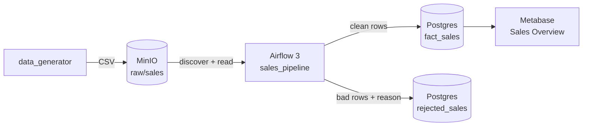

# Mini Data Platform

A Dockerised data platform with an automated CI/CD pipeline: synthetic sales
data lands in object storage, Airflow cleans and loads it into Postgres, and
Metabase serves it. Every hop is verified end to end by GitHub Actions.



## Quickstart

```bash
make venv                      # venv on Python 3.12+, pinned deps
cp .env.example .env && make secrets
make doctor                    # toolchain, ports, disk
make up                        # build, start, wait healthy, provision Metabase
make seed                      # generate a batch and upload it to MinIO
```

Then unpause `sales_pipeline` in the Airflow UI, or run `make e2e` to drive the
whole flow and assert the result. The **Sales Overview** dashboard is already
built in Metabase and populates as soon as data lands.

| Service | URL | Credentials |
| :-- | :-- | :-- |
| Airflow | http://localhost:8082 | `AIRFLOW_ADMIN_USER` / `AIRFLOW_ADMIN_PASSWORD` |
| MinIO console | http://localhost:9003 | `MINIO_ROOT_USER` / `MINIO_ROOT_PASSWORD` |
| Metabase | http://localhost:3001 | `METABASE_ADMIN_EMAIL` / `METABASE_ADMIN_PASSWORD` |
| Postgres | localhost:5435 | `POSTGRES_USER` / `POSTGRES_PASSWORD` |

Ports avoid a host Postgres on 5432 and MySQL on 3306. All values live in
`.env`, which `make secrets` fills with random credentials.

## Make targets

| Target | Does |
| :-- | :-- |
| `make doctor` | preflight: toolchain, venv hygiene, port conflicts, disk |
| `make up` / `make down` | start (build + wait healthy + provision) / stop |
| `make seed` | generate a synthetic batch, upload to MinIO |
| `make lint` | ruff, yamllint, hadolint, shellcheck |
| `make test` | unit tests, no Docker needed |
| `make dags` | parse the DAG bag inside the Airflow image |
| `make e2e` | end-to-end suite against the running stack |
| `make ci` | what CI's fast tier runs |
| `make provision` | re-run Metabase provisioning (idempotent) |
| `make nuke` | stop and delete this project's volumes |

## How the pipeline works

1. `data_generator` writes a seeded CSV with deliberately corrupted rows and a
   manifest stating how many rows should survive cleaning.
2. `sales_pipeline` discovers unprocessed objects in MinIO, mapping one task
   per batch.
3. `mini_platform.transforms.clean` returns `(clean, rejects)`. Bad rows are
   quarantined with a reason, never silently dropped.
4. `mini_platform.warehouse` stages rows in a temp table, deletes the batch's
   previous attempt, then upserts on `order_id`.
5. Metabase reads `fact_sales` from the `analytics` database.

## Dashboard

`make up` provisions a **Sales Overview** dashboard from
[`config/dashboard.yml`](config/dashboard.yml) through the Metabase API — it is
never clicked together by hand, so it rebuilds identically on any machine.

| KPIs | Trends and breakdowns |
| :-- | :-- |
| Total revenue | Revenue by day |
| Orders | Revenue by category |
| Average order value | Revenue by country |
| Rows quarantined | Orders by payment method |
| | Rejected rows by reason |

Quarantined rows sit on the dashboard deliberately: ingestion quality is a KPI,
not something to hide in a log.

## Design notes

**The load is idempotent.** Airflow retries, and replays happen. Rows go to a
staging table, the batch is cleared, then merged on the natural key, so running
the same batch twice leaves the row count unchanged. The end-to-end suite
asserts this explicitly.

**Business logic lives outside Airflow.** `mini_platform` is plain Python with
no Airflow imports, so the cleaning contract is unit-tested in under a second
with no containers. The DAG only moves data between systems.

**Rules are configuration, not code.** `config/pipeline.yml` holds the data
contract, thresholds and vocabularies; `.env` holds hosts, ports and
credentials. Currencies were once declared in two modules, which meant the
generator could emit rows its own validator rejected — there is now a
regression test pinning that.

**Tests assert against the manifest.** Expected row counts come from the
generator's deliberate corruption, not from the transform's own output, so a
broken transform cannot make the suite pass. Verified by disabling
de-duplication: 5 of 7 end-to-end tests failed.

**Discovery uses warehouse state.** The DAG lists MinIO and subtracts batches
already loaded, rather than relying on a sensor's memory, so a wiped scheduler
still behaves correctly.

**Nothing is configured by hand.** Airflow's admin password comes from `.env`,
and Metabase's admin plus its database registration are created through the
setup API by `scripts/provision_metabase.py`. There is no setup wizard to click,
which is what lets CI verify the final hop.

## CI/CD

`.github/workflows/main.yml` runs two tiers:

- **Fast tier** — `lint`, `unit` and `dags` in parallel, no services required.
- **Integration tier** — gated behind them; builds the platform, provisions
  Metabase, runs the end-to-end suite, uploads compose logs as an artifact on
  failure, and always tears down.
- **Publish** — on `main`, pushes the runtime image to GHCR tagged
  `sha-<commit>`. Never `latest`: a mutable tag is how CI goes green while the
  environment keeps running older code.
- **Deploy to test** — pulls that exact published image and runs the stack with
  `--no-build`, then smoke-tests the data flow through it. Nothing is rebuilt,
  so what is verified is the artifact that would ship.

CI calls the same `make` targets you do, so the runbook and the pipeline cannot
drift. No repository secrets are needed; GHCR uses the built-in `GITHUB_TOKEN`.

**Notifications.** GitHub already emails the committer on a failed run, so no
webhook is wired up — a second channel would be noise. What the pipeline adds is
making that email actionable: a failed end-to-end run writes a table of
per-service state into the run summary and attaches the compose logs as an
artifact, and a deploy records which image reference it verified.

### Promoting to production

`deploy-test` deploys to an ephemeral environment on the runner. Promoting the
same digest to a long-lived host would be one further job gated behind a GitHub
Environment with required reviewers. That is not wired up: there is no server
behind this lab, and a fake deploy would be worse than an honest gap.

## Gotchas worth knowing

| Symptom | Cause |
| :-- | :-- |
| `No module named 'airflow'` | `AIRFLOW_UID` must stay `50000`; Python skips site-packages it does not own |
| `httpx.ConnectError` in a task | Airflow 3 workers call `core.execution_api_server_url`, which defaults to localhost |
| `Invalid auth token` | `api_auth.jwt_secret` must be identical across every Airflow service |
| MinIO image will not pull | Docker Hub no longer serves `minio/minio`; images come from `quay.io` |
| Code edit has no effect | `mini_platform` is baked into the image — `make up` rebuilds |
| Metabase rejects a password | its complexity policy needs digits, which `make secrets` guarantees |
| `password authentication failed for user "platform"` | volumes from an earlier run survived a new `make secrets`. Postgres only applies credentials to an empty data dir, so it kept the old ones. Restore the matching `.env`, or `make nuke && make secrets` to discard the data |

The host exports ROS2's Python 3.12 paths on `PYTHONPATH`, which leak into a
3.14 venv. Every Python call in the Makefile strips it; never invoke
`.venv/bin/python` directly.

## Brief compliance

[`docs/brief-compliance.md`](docs/brief-compliance.md) maps every clause of the
brief to its implementation and the test that proves it.

## Layout

```text
dags/                 Airflow DAG definitions
mini_platform/        transforms, warehouse, storage, config — no Airflow imports
data_generator/       seeded synthetic batches with a manifest
config/               pipeline.yml (rules), dashboard.yml, Postgres init
docker/airflow/       runtime and test image stages
scripts/              doctor, secrets, Metabase provisioning
tests/unit/           fast, no Docker
tests/integration/    end to end against a running stack
.github/workflows/    CI/CD pipeline
```
