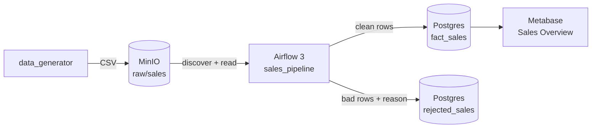

# Mini Data Platform

Synthetic sales data lands in object storage, Airflow cleans and loads it into
Postgres, Metabase serves it, all as a containerised platform. Every hop is verified by GitHub Actions.



## Quickstart

```bash
make venv                      # venv on Python 3.12+, pinned deps
cp .env.example .env && make secrets
make doctor                    # toolchain, ports, disk
make up                        # build, start, wait healthy, provision Metabase
make seed                      # generate a batch and upload it to MinIO
```


Then unpause `sales_pipeline` in Airflow or run:

```bash
make e2e
```

The **Sales Overview** dashboard is provisioned automatically.

| Service    | URL                   |
| :--------- | :-------------------- |
| Airflow    | http://localhost:8082 |
| MinIO      | http://localhost:9003 |
| Metabase   | http://localhost:3001 |
| PostgreSQL | localhost:5435        |

Configuration is managed through `.env`.

## Pipeline

1. `data_generator` creates reproducible CSV batches containing valid and intentionally corrupted rows.
2. Airflow discovers unprocessed batches from MinIO.
3. `mini_platform.transforms.clean` separates valid rows from rejected rows and records rejection reasons.
4. A configurable quality gate stops batches exceeding `max_reject_ratio`.
5. Clean data is staged and upserted into `fact_sales`; rejected rows are stored in `rejected_sales`.
6. `verify_load` validates the completed warehouse write.
7. Metabase reads the analytics tables for reporting.


Airflow dynamically maps ingestion tasks so each discovered batch is processed independently.

A separate `warehouse_maintenance` DAG removes rejected records older than the configured retention period.

## Dashboard

`make up` provisions the **Sales Overview** dashboard from `config/dashboard.yml`.

It includes:

| KPIs                | Breakdowns               |
| :------------------ | :----------------------- |
| Total revenue       | Revenue by day           |
| Orders              | Revenue by category      |
| Average order value | Revenue by country       |
| Rows quarantined    | Orders by payment method |
|                     | Rejections by reason     |

Rejected rows are included so data quality remains visible alongside business metrics.


## Key Design Decisions

| Decision                                 | Purpose                                            |
| :--------------------------------------- | :------------------------------------------------- |
| Staging + batch replacement + upsert     | Safe retries without duplicate data                |
| Transformation logic outside Airflow     | Fast unit testing without containers               |
| Central rules in `config/pipeline.yml`   | Single source of truth for validation              |
| Generator manifest used in tests         | Independent verification of expected results       |
| `pipeline_runs` ledger                   | Tracks processed batches, including failures       |
| Pre- and post-load validation            | Protects both transformed data and warehouse state |
| Deterministic failures are non-retryable | Retries are reserved for transient faults          |
| Dashboard provisioned through API        | Reproducible and CI-verifiable setup               |

A batch that exceeds the allowed rejection ratio fails before warehouse data is written.


## CI/CD

GitHub Actions validates the platform through:

| Stage                        | Purpose                                             |
| :--------------------------- | :-------------------------------------------------- |
| `lint`, `unit`, `dags`       | Fast static, unit, and DAG validation               |
| `end-to-end`                 | Builds the full platform and runs integration tests |
| `publish image`              | Pushes a commit-specific image to GHCR              |
| `deploy to test environment` | Deploys and smoke-tests the exact built image       |

`main` is protected from direct pushes. Required checks must pass before merging.

CI uses the same `make` targets used locally, reducing differences between development and automation.

Failed runs upload service logs and diagnostic information.

### Production Promotion

The test deployment uses an ephemeral CI environment. Production deployment is intentionally not configured because this lab has no persistent production host.

## Common Commands

| Command                 | Purpose                                  |
| :---------------------- | :--------------------------------------- |
| `make doctor`           | Check tools, ports, disk and environment |
| `make up` / `make down` | Start or stop the platform               |
| `make seed`             | Generate and upload sample data          |
| `make lint`             | Run static checks                        |
| `make test`             | Run unit tests                           |
| `make dags`             | Validate Airflow DAGs                    |
| `make e2e`              | Run end-to-end tests                     |
| `make ci`               | Run the fast CI checks locally           |
| `make provision`        | Re-provision Metabase                    |
| `make nuke`             | Remove containers and project volumes    |

 
 