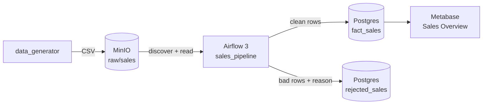
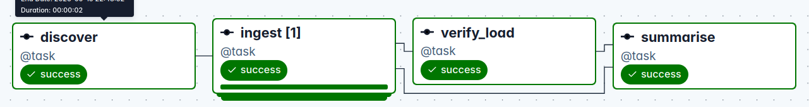
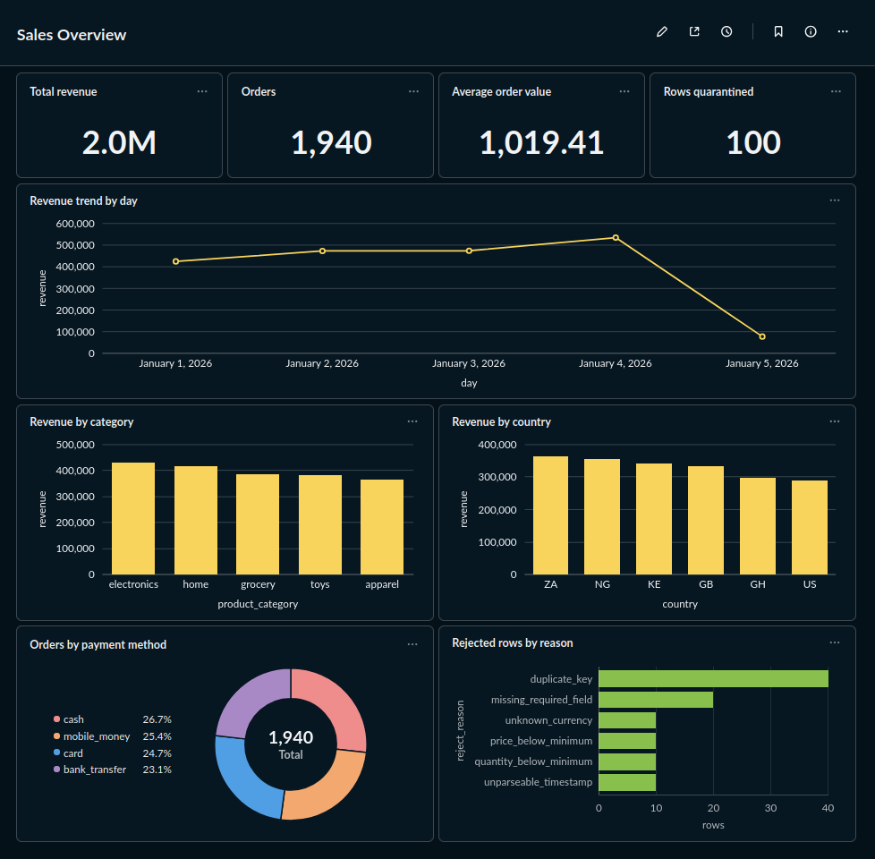

# Mini Data Platform

Synthetic sales data lands in object storage, Airflow cleans and loads it into
Postgres, Metabase serves it. Every hop is verified by GitHub Actions.



## Quickstart

```bash
make venv                      # venv on Python 3.12+, pinned deps
cp .env.example .env && make secrets
make doctor                    # toolchain, ports, disk
make up                        # build, start, wait healthy, provision Metabase
make seed                      # generate a batch and upload it to MinIO
```

Unpause `sales_pipeline` in the Airflow UI, or run `make e2e`. The **Sales
Overview** dashboard is already built and populates as data lands.

| Service | URL |
| :-- | :-- |
| Airflow | http://localhost:8082 |
| MinIO console | http://localhost:9003 |
| Metabase | http://localhost:3001 |
| Postgres | localhost:5435 |

Ports avoid a host Postgres on 5432 and MySQL on 3306. Values live in `.env`,
filled by `make secrets`.

## Make targets

| Target | Does |
| :-- | :-- |
| `make doctor` | preflight: toolchain, venv hygiene, port conflicts, disk |
| `make up` / `make down` | start (build + wait healthy + provision) / stop |
| `make seed` | generate a synthetic batch, upload to MinIO |
| `make lint` | ruff, yamllint, hadolint, shellcheck |
| `make test` | unit tests, no Docker needed |
| `make dags` | parse the DAG bag inside the Airflow image |
| `make e2e` | end-to-end suite against the running stack |
| `make ci` | what CI's fast tier runs |
| `make provision` | re-run Metabase provisioning (idempotent) |
| `make nuke` | stop and delete this project's volumes |

## How the pipeline works

1. `data_generator` writes a seeded CSV with deliberately corrupted rows and a
   manifest stating how many rows should survive cleaning.
2. `sales_pipeline` discovers objects in MinIO that the run ledger has not
   seen, mapping one task per batch.
3. `mini_platform.transforms.clean` returns `(clean, rejects)`. Bad rows are
   quarantined with a reason, never silently dropped. A batch past
   `max_reject_ratio` fails before anything is written.
4. `mini_platform.warehouse` stages rows in a temp table, deletes the batch's
   previous attempt, then upserts on `order_id`, and records the attempt in
   `pipeline_runs`.
5. `verify_load` re-checks the fact table after the load.
6. Metabase reads `fact_sales` from the `analytics` database.



`ingest` is dynamically mapped — one task instance per batch `discover` finds.

A second DAG, `warehouse_maintenance`, runs daily and prunes quarantined rows
past `reject_retention_days`.

## Dashboard

`make up` builds **Sales Overview** from [`config/dashboard.yml`](config/dashboard.yml)
through the Metabase API, so it rebuilds identically on any machine.

| KPIs | Trends and breakdowns |
| :-- | :-- |
| Total revenue | Revenue by day |
| Orders | Revenue by category |
| Average order value | Revenue by country |
| Rows quarantined | Orders by payment method |
| | Rejected rows by reason |

Quarantined rows are on the dashboard deliberately: ingestion quality is a KPI.



## Design notes

| Decision | Why |
| :-- | :-- |
| Staging table, delete-by-batch, upsert | Airflow retries; a re-run must not double-count |
| Logic outside Airflow | `mini_platform` imports no Airflow, so 39 unit tests run in 0.5s with no containers |
| Rules in `config/pipeline.yml` | currencies were once declared twice, so the generator could emit rows its own validator rejected |
| Tests assert against the generator manifest | comparing a transform to its own output always passes; disabling de-duplication failed 5 of 7 e2e tests |
| Discovery keys on `pipeline_runs`, not `fact_sales` | a gate-failed batch never lands, so it would be re-attempted forever |
| Checks on both sides of the write | `assert_quality` guards the frame, `verify_load` re-queries the table |
| Non-retryable deterministic failures | a bad file fails identically every time; retries are for transient faults |
| Provisioned via APIs, never clicked | a hand-made dashboard cannot be verified by CI |

A batch past `max_reject_ratio` fails before anything is written, rather than
loading a fraction of the rows and reporting success:


## CI/CD

`.github/workflows/main.yml` runs two tiers:

| Job | Does |
| :-- | :-- |
| `lint` `unit` `dags` | fast tier, parallel, no services, under 90s |
| `end-to-end` | builds the platform, provisions Metabase, runs the integration suite |
| `publish image` | pushes to GHCR tagged `sha-<commit>`, never `latest` |
| `deploy to test environment` | pulls that exact image, `--no-build`, smoke-tests it |

`main` is protected: no direct pushes, the four checks must pass, and auto-merge
lands a PR the moment they do. CI runs the same `make` targets you do, so the
runbook cannot drift. No repository secrets — GHCR uses `GITHUB_TOKEN`.

A failed run writes per-service state into the run summary and uploads compose
logs; GitHub's own email is the notification.

### Promoting to production

`deploy-test` deploys to an ephemeral environment on the runner. Promoting the
same digest to a long-lived host is one further gated job — not wired up, since
there is no server behind this lab and a fake deploy would be worse.

## Contributing

`main` is protected: it takes no direct pushes, and a change merges only once
`lint`, `unit tests`, `dag integrity` and `end-to-end` are green.

```bash
git switch -c fix/short-description
# change, then:
make ci                 # the fast tier, before pushing
git push -u origin HEAD
gh pr create --fill
```

Branches are short-lived — opened and merged the same day, deleted on merge.
Long-lived branches defer integration, which is the opposite of what CI is for.
Run `make e2e` locally for anything touching the pipeline; CI runs it too, but
the feedback is ten minutes faster on your own stack.

## Brief compliance

[`docs/brief-compliance.md`](docs/brief-compliance.md) maps every clause of the
brief to its implementation and the test that proves it.

## Layout

```text
dags/                 Airflow DAG definitions
mini_platform/        transforms, warehouse, storage, config — no Airflow imports
data_generator/       seeded synthetic batches with a manifest
config/               pipeline.yml (rules), dashboard.yml, Postgres init
docker/airflow/       runtime and test image stages
scripts/              doctor, secrets, Metabase provisioning
tests/unit/           fast, no Docker
tests/integration/    end to end against a running stack
.github/workflows/    CI/CD pipeline
```
